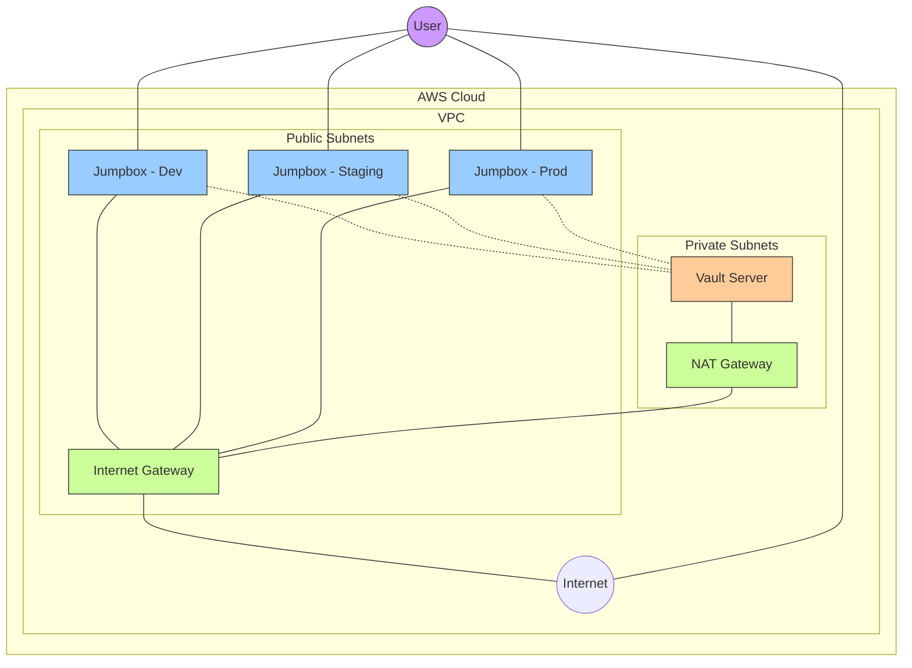
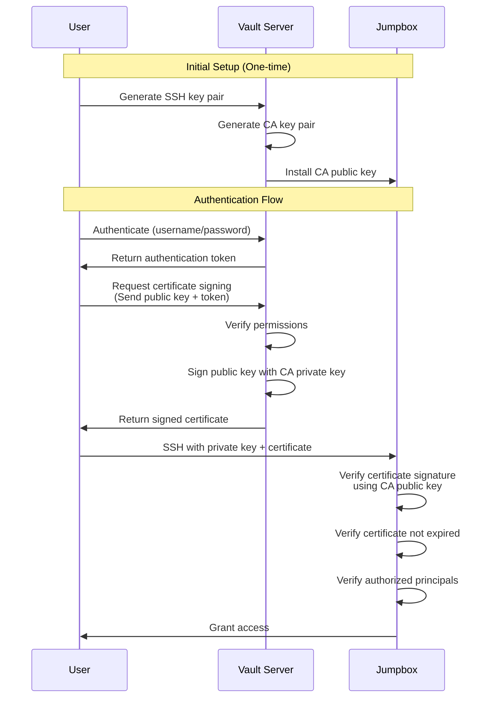
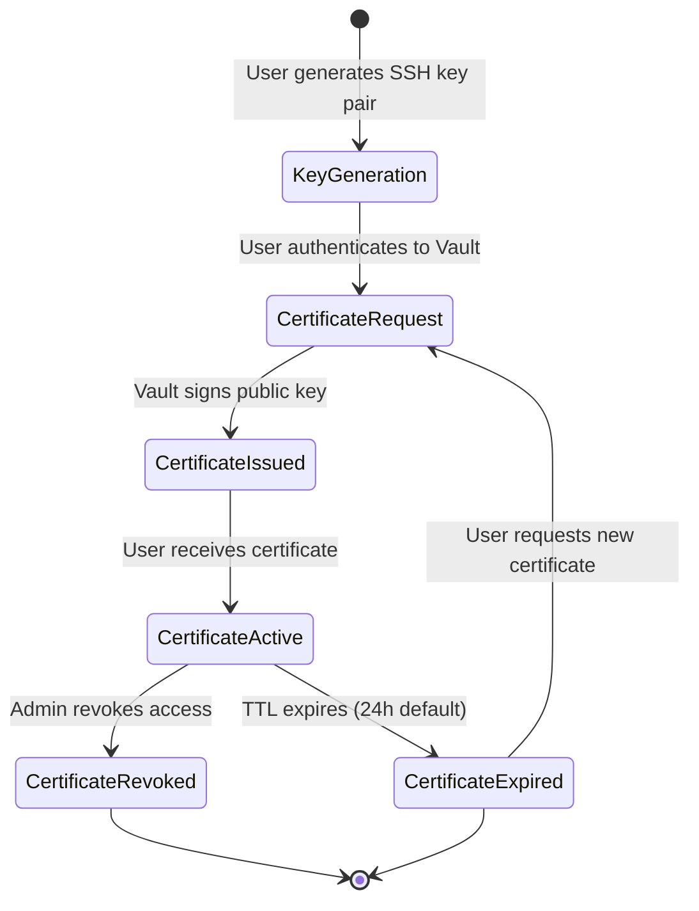
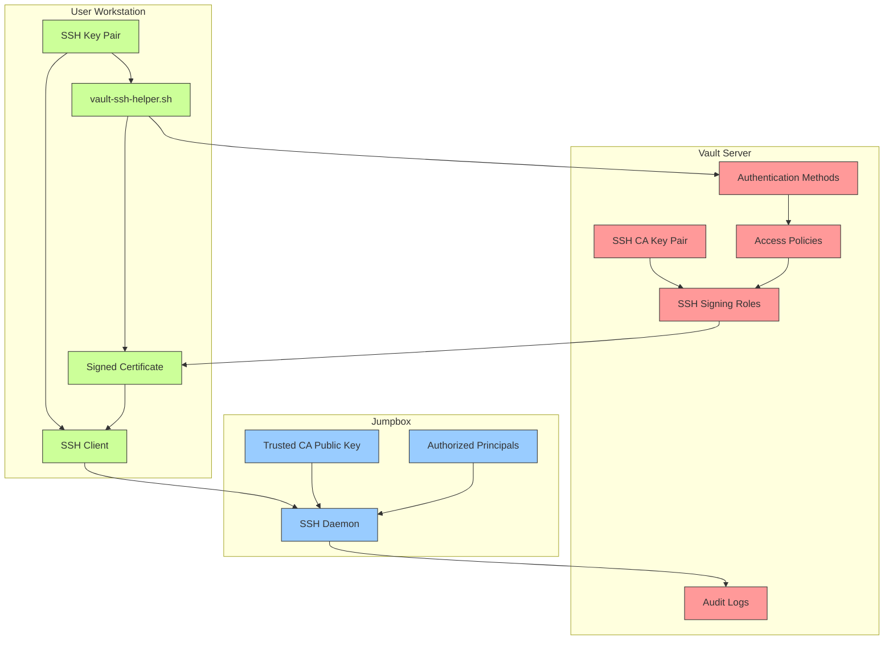
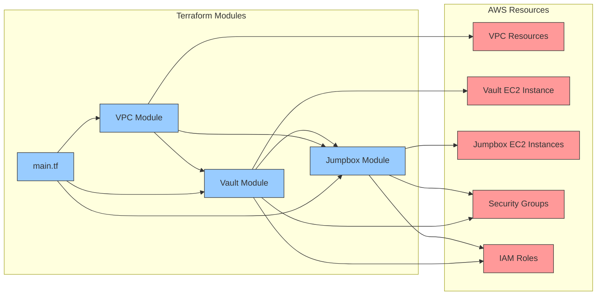
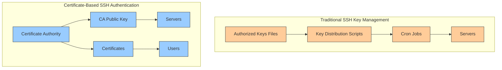

# SSH Certificate Authority Flow Diagrams

## Network Architecture Diagram

## SSH Certificate Authentication Flow

## Certificate Lifecycle

## Component Relationships

## Terraform Resource Relationships

## Comparison with Traditional SSH Key Management

